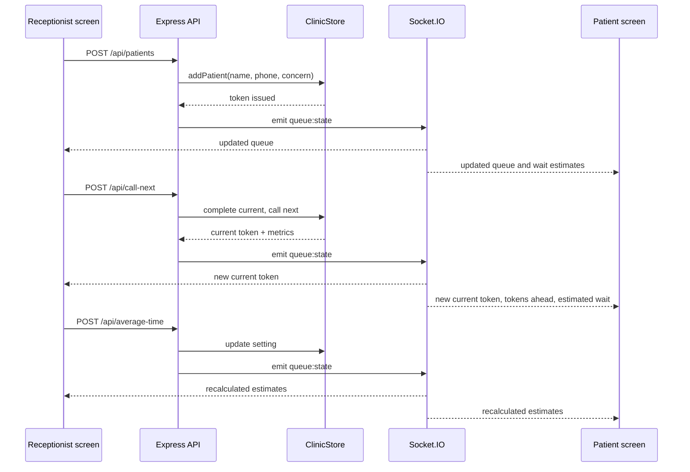

# Socket Event Diagram

## Events

| Event | Direction | Payload |
| --- | --- | --- |
| `queue:state` | Server to all clients | Current token, waiting queue, completed summary, settings, metrics |

The client does not directly mutate queue state over sockets. All writes go through HTTP routes so validation and persistence stay in one place. Socket.IO is used for fan-out after the state changes.
